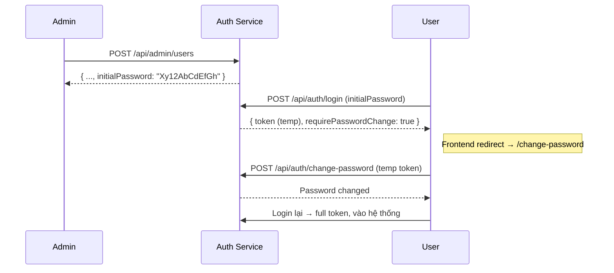

# User Portal – Authentication Service  
**Force Change Password Flow**

## 1. Tổng quan dịch vụ

Microservice chịu trách nhiệm:
- Quản lý user đa tổ chức (AdFlex, Ultra, MB, ...)
- Xác thực JWT stateless
- Bắt buộc đổi mật khẩu ngay lần đăng nhập đầu tiên khi Admin tạo tài khoản hộ
- Reset password về trạng thái ban đầu (chỉ Admin được quyền, an toàn 100%)

### Nguyên tắc bảo mật số 1
> Không ai được vào hệ thống nếu chưa tự tay đổi mật khẩu của chính mình.

### Các tính năng cốt lõi
- Raw initial password chỉ trả về đúng 1 lần khi tạo user
- Lưu vĩnh viễn `initialPasswordHash` để reset an toàn
- JWT lần đầu có flag `isTemp=true` → chỉ được gọi `/change-password`
- Login response trả `requirePasswordChange: true` → Frontend redirect ngay
- Reset password → copy `initialPasswordHash` → `passwordHash` + bật lại force flag

### Luồng hoạt động



## 2. Tech Stack

| Component           | Technology / Version                    |
|---------------------|-----------------------------------------|
| Java                | 21                                      |
| Framework           | Spring Boot 3.3+ (parent 4.0.0)         |
| Security            | Spring Security + JWT (jjwt 0.11.5)     |
| Password Hashing    | BCrypt                                  |
| Database            | PostgreSQL 15+                          |
| ORM                 | Spring Data JPA + Hibernate             |
| Build Tool          | Maven                                   |
| Lombok              | Yes                                     |
| Testing             | JUnit 5, SpringBootTest, Testcontainers |

## 3. Cấu trúc project (chỉ các package quan trọng)

```
src/main/java/com/example/user_portal/
├── controller      → AdminController, AuthController
├── dto             → Request/Response objects
├── entity          → User (forceChangePassword + initialPasswordHash)
├── enums           → Role, Organization
├── repository      → UserRepository
├── security        → JwtUtil, JwtAuthenticationFilter, SecurityConfig
├── service         → AuthService, UserService
└── UserPortalApplication.java
```

## 4. Các API chính

| Method | Endpoint                          | Quyền truy cập          | Mô tả                                                      |
|--------|-----------------------------------|--------------------------|------------------------------------------------------------|
| POST   | `/api/admin/users`                | ADMIN                    | Tạo user mới → trả raw initialPassword (chỉ lần đầu)       |
| POST   | `/api/auth/login`                 | Public                   | Đăng nhập → trả temp/full token + flag nếu cần đổi mật khẩu |
| POST   | `/api/auth/change-password`       | Temp token hoặc Full JWT | Đổi mật khẩu (temp token không cần oldPassword)            |
| POST   | `/api/admin/users/{id}/reset`     | ADMIN                    | Reset về initial password + bật lại force change          |
| POST   | `/api/auth/register-admin`        | Public (chỉ dùng 1 lần)  | Tạo admin đầu tiên của hệ thống                            |

### Quy tắc mật khẩu
- Tối thiểu 8 ký tự  
- Có ít nhất 1 chữ hoa  
- Có ít nhất 1 số

## 5. Configuration (dev)

```properties
spring.application.name=user-portal

# PostgreSQL
spring.datasource.url=jdbc:postgresql://localhost:5432/userportal
spring.datasource.username=devuser
spring.datasource.password=devpass

# JPA
spring.jpa.hibernate.ddl-auto=update
spring.jpa.show-sql=true
spring.jpa.properties.hibernate.format_sql=true

# JWT – BẮT BUỘC đổi trước khi lên prod
jwt.secret=your-very-very-long-random-secret-key-here
jwt.expiration=86400000   # 24h
```

## 6. Cách chạy

```bash
./mvnw spring-boot:run                  # dev profile mặc định
./mvnw spring-boot:run -Dspring-boot.run.profiles=prod   # prod
```

→ http://localhost:8080

## 7. Điểm bảo mật quan trọng

| Quy tắc                              | Cách triển khai                                          |
|--------------------------------------|-----------------------------------------------------------|
| Raw password chỉ hiện 1 lần          | Chỉ có trong response của POST /api/admin/users           |
| Không bao giờ log plaintext          | Toàn bộ code không có log.info/password gì cả             |
| Temp token bị giới hạn quyền         | JwtAuthenticationFilter chặn hết trừ /change-password     |
| Reset password an toàn 100%          | Dùng initialPasswordHash đã lưu vĩnh viễn                 |
| User mới tạo luôn phải đổi mật khẩu  | forceChangePassword = true mặc định                       |

## 8. Test

```bash
./mvnw test      # unit test
./mvnw verify    # integration test + Testcontainers
```

Phải pass 100% các kịch bản sau.

## 9. Deployment & Monitoring
Chưa có (sẽ bổ sung sau)

## 10. Troubleshooting thường gặp

| Triệu chứng                          | Nguyên nhân                              | Cách khắc phục                          |
|--------------------------------------|------------------------------------------|------------------------------------------|
| Bị redirect mãi về đổi mật khẩu      | forceChangePassword vẫn true             | Đổi mật khẩu lại hoặc reset             |
| Không thấy raw password khi tạo user | Chỉ hiển thị lần đầu                     | Dùng chức năng reset                    |
| Temp token bị 403 mọi nơi            | Đúng thiết kế                            | Phải đổi mật khẩu trước mới vào được    |
| Reset không hoạt động                | User cũ không có initialPasswordHash     | Tạo lại user mới                        |

## 11. Người chịu trách nhiệm
**Owner**: Lê Tùng Quân
